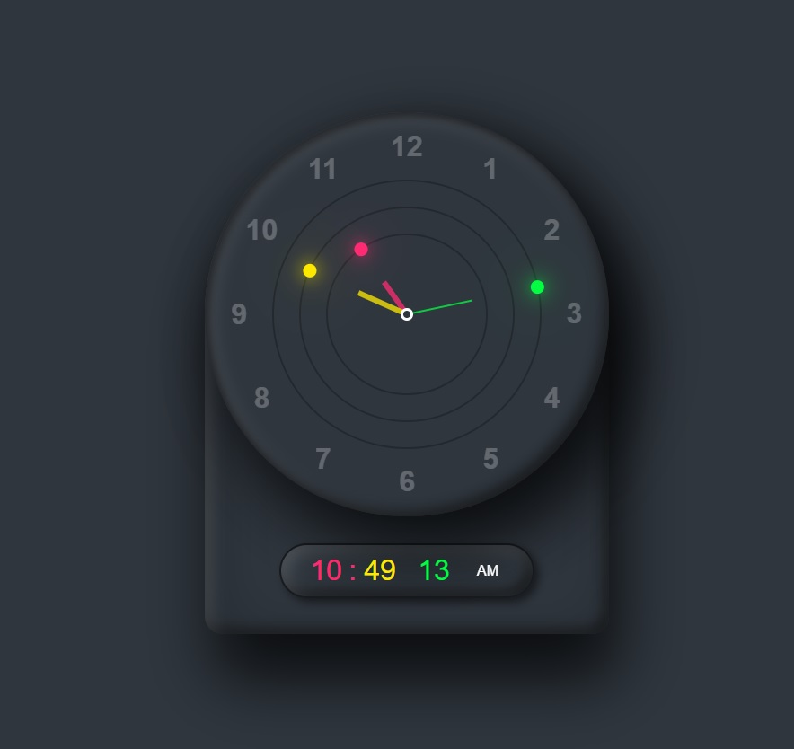

# Digital Clock - Estudo de Animação



# Apoio para a criação

https://www.youtube.com/watch?v=yXFiTDfhSXo

## Tecnólogias Utilizadas

Hmtl
CSS 
JavaScript

## Instalação

Você precisará clonar este repositório:
```sh
  $ git clone https://github.com/Bruno-Goudric/clock.git
```

Depois disso acesse a pasta do projeto e clique no documento 
index.html

